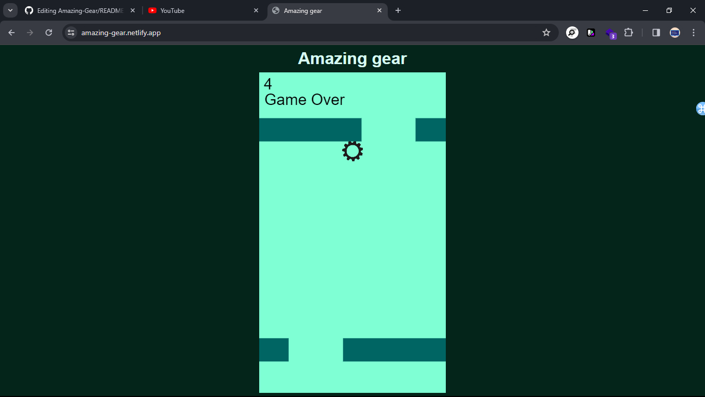

# AMAZING GEAR GAME CLONNING WITH JAVASCRIPT
---

### Preview
#### [Live Preview](https://amazing-gear.netlify.app/) *//For Desktop Users** 

### How to Use?

- Simply open the `index.html` file in a web browser.
- use right and left arrow key of your keyboard to move up.
- use space key to restart the game
- It is not fully working on mobile devices. so recommended to use desktop.

## Technologies Used

- HTML
- CSS
- **JavaScript** (canvas)

## Contributing

Contributions are welcome! Please feel free to submit any bug fixes or enhancements as pull requests.

## Contact

For any questions or inquiries, feel free to contact the project maintainer on [telegram](https://t.me/henaorth).
